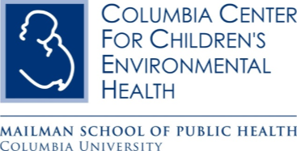
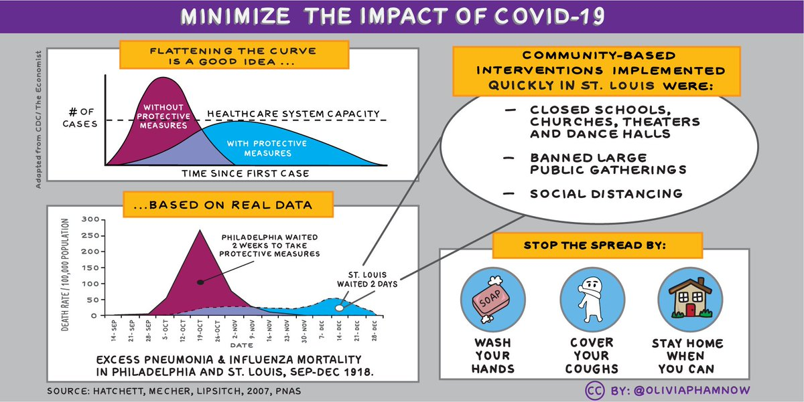

## A message from CCCEH

In three months, with 108,000 lives taken away by the Coronavirus, again, we are reminded of the disproportionate burden suffered by communities of color and low-income communities.

Centuries of human rights abuses endured by members of our African-American community, compounded still by systemic racism, demand that we stand for the change that is needed.

Let's use this moment in time to teach our children about race and racism.  Let's acknowledge the hurt, the deep impact of racism and racial inequity on all aspects of our society and start the hard work of *building a better world, and a brighter future*.  

**List of Resources for Anti-Racism and Talking about Race and Racism with Children**
https://www.theprimaryschool.org/blog/2020/6/2/resources-for-anti-racism-and-talking-about-race-and-racism-with-children

***

 We hope you and your family are doing well in the midst of this rapid coronavirus outbreak (COVID-19).  We want to take a moment to update you on possible efforts to protect your health. 

We have put in place public health measures that can help slow the spread of disease by reducing opportunities for sick individuals to come in contact with healthy ones. Therefore, we have temporarily paused all in-person study visits. However, we will stay in close touch with you via telephone so that we can continue the work together. 

## Protect yourself and your family  
We also want to remind you of simple things we can all do to protect yourselves and reduce the chance of spreading the novel coronavirus:

* Wash your hands often.

* Avoid touching your eyes, nose, and mouth with unwashed hands.

* Avoid close contact with people who are sick.

* Stay home when you are sick.

* Cover your cough or sneeze.

* If you have to leave your home, wear a facemask and stay at least 6 feet away from others.

* Clean and disinfect frequently touched objects and surfaces.

 
## Ways to reduce stress
Share the facts about COVID-19 and understand actual risk to yourself and people you care about.

* Take breaks from watching, reading, or listening to news stories, including social media. Hearing about the pandemic repeatedly can be upsetting.

* Take care of your body. Take deep breaths, stretch, or meditate. Try to eat healthy, well-balanced meals, exercise and get plenty of sleep.

* Make time to unwind. Try to do some other activities you enjoy.

* Connect with others. Talk with people you trust about your concerns and how you are feeling.
 
We are committed to staying connected with you during this challenging situation. 

Please reach out to the center if you have any questions or need guidance regarding credible sources of information about COVID-19, preventive measures, and ways to care for each other and protect your community's health. We will continue to monitor this situation and answer any questions and concerns you may have. 

