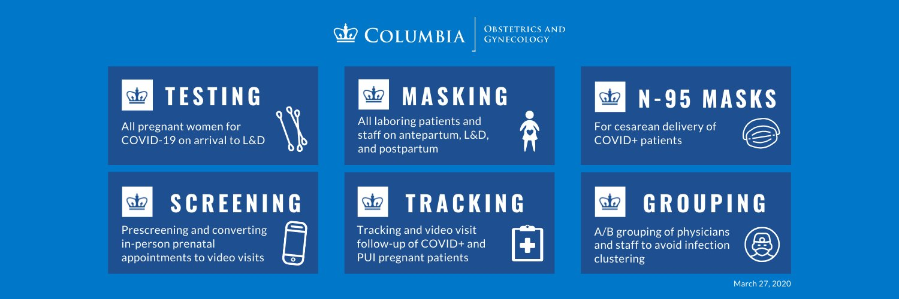

***

# *English* 

### If you are pregnant: 

* Hospitals including NY Presbyterian have made many preparations to make sure that **delivering your baby at the hospital is safe** for you and your baby. 

### Delivering at NY Presbyterian:   

* Information for patients planning to deliver at NY Presbyterian.  

* On the website below, you can learn how to **schedule video visits** to connect with a doctor.  **Outpatient offices remain open.**
https://www.columbiaobgyn.org/news/coronavirus-covid-19-and-pregnancy-q-columbia-ob-gyn-physicians

### Q&A from Columbia OB/GYN Doctors:
The information below (and more) is available at:  https://www.columbiaobgyn.org/news/coronavirus-covid-19-and-pregnancy-q-columbia-ob-gyn-physicians

#### Are the symptoms of COVID-19 infection different in pregnant women?
* At this time, not much is known about the effects of COVID-19 in pregnancy, but it appears that the symptoms are identical and equal in severity with non-pregnant women.

#### Are there additional risks of COVID-19 infection in the pregnant population?
* There is only limited information on the effects of COVID-19 on pregnant women and their babies due to a small number of cases. Pregnant women experience changes in their bodies that may increase their risk of some viral infections, but it’s not known where COVID-19 is among them.

* At this time, there is no data to suggest increased risk of congenital malformations in pregnant women who get COVID-19. There are some reports of increased risk of premature deliveries, but this appears to be due to increased need for emergency premature deliveries to assist maternal treatment, and not due to increased risk of preterm labor.

#### Can I pass COVID-19 to my fetus during pregnancy or delivery?
* Data from a small number of pregnant women have not detected COVID-19 in newborns, amniotic fluid, or umbilical cord blood from infected mothers. Previous studies from similar viruses also support that the infection does not pass to the unborn fetus.

#### Can I pass COVID-19 in breastmilk?
* Data is limited, but there are no reports of COVID-19 in breastmilk. 

***

# *Español*

### Si está embarazada: 

* Los hospitales, incluido el Hospital Presbiteriano, se han preparado para que **su parto en el hospital sea seguro para usted y su bebé**.

### Dar a a luz en el Hospital Prebiteriano:   

* Información para pacientes que planean dar a luz en el Hospital Presbiteriano. 

* En el siguiente página electrónica, puede encontrar información sobre cómo programar visitas médicas por video. **Las clínicas ambulatorias permanecen abiertas**.

https://www.columbiaobgyn.org/news/coronavirus-covid-19-and-pregnancy-q-columbia-ob-gyn-physicians

### Preguntas y Respuestas de Médicos deObstetricia/Ginecología de Columbia:
* Usted puede encontrar información (y más) disponible en la siguiente página electrónica: https://www.columbiaobgyn.org/news/coronavirus-covid-19-and-pregnancy-q-columbia-ob-gyn-physicians

#### ¿Los síntomas de la infección por COVID-19 son diferentes en mujeres embarazadas?
* En este momento, no se sabe mucho sobre los efectos de COVID-19 en el embarazo, pero parece que los síntomas son idénticos o iguales en gravedad en mujeres embarazadas que en mujeres no embarazadas.

#### ¿Existen riesgos adicionales de infección por COVID-19 en la población embarazada?
* Hay información limitada sobre los efectos de COVID-19 en mujeres embarazadas y sus bebés debido a la existencia de un pequeño número de casos. Las mujeres embarazadas experimentan cambios en sus cuerpos que pueden aumentar el riesgo a adquirir algunas infecciones virales, pero no se sabe si el COVID-19 es parte de ellas.

* En este momento, no hay datos que sugieran un mayor riesgo de malformaciones congénitas en mujeres embarazadas contagiadas de COVID-19. Hay algunos informes que sugieren un mayor riesgo de partos prematuros, pero esto parece deberse a la necesidad de partos prematuros de emergencia para ayudar a la madre y no debido a un mayor riesgo de parto premature per se. 

#### ¿Puedo pasar COVID-19 a mi bebé durante el embarazo o el parto?
* Datos tomados de un pequeño número de mujeres embarazadas contagiadas, no han detectado COVID-19 en recién nacidos, líquido amniótico o sangre del cordón umbilical. Estudios previos de virus similares también demuestran que la infección no pasa al feto al nacer.

#### ¿Puedo pasar COVID-19 en la Leche Materna?
* De nuevo, los datos son limitados, pero no hay informes de COVID-19 en la leche materna.Again, the data is limited, but there are no reports of COVID-19 in breastmilk. 

***

# Helpful Websites/Página electrónicas útiles:

**CDC website for Pregnant and Breastfeeding Women re: COVID-19:**

[**Página electrónica CDC (Centro para el Control y la Prevención de Enfermedades) para mujeres embarazadas y lactantes: COVID-19:**]

https://www.cdc.gov/coronavirus/2019-ncov/prepare/pregnancy-breastfeeding.html?CDC_AA_refVal=https%3A%2F%2Fwww.cdc.gov%2Fcoronavirus%2F2019-ncov%2Fspecific-groups%2Fpregnancy-faq.html

**March of Dimes**:
https://www.marchofdimes.org/complications/coronavirus-disease-covid-19-what-you-need-to-know.aspx

