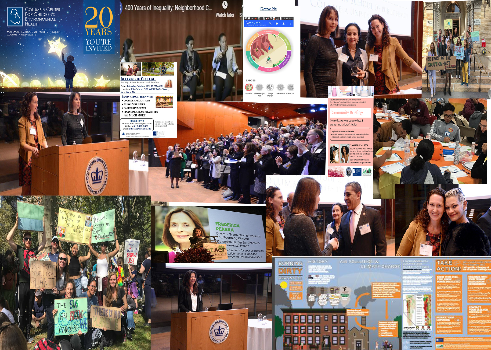

## Mensaje del CCCEH

El Centro de Columbia para la Salud Ambiental de los Niños espera que usted y su familia se encuentren bien durante la propagación del coronavirus (COVID-19). Por medio de esta carta, queremos actualizarlos sobre nuestros esfuerzos para proteger su salud.
 
Hemos puesto en marcha medidas de salud pública que pueden ayudar a disminuir la propagación de este virus y que pueden prevenir que personas enfermas entren en contacto con personas sanas. Por lo tanto, hemos tomado la decisión de pausar temporalmente nuestras visitas en persona. Sin embargo, nos mantendremos en estrecho contacto con usted por teléfono para que podamos continuar nuestro trabajo juntos.
 
## Protéjase a usted mismo y a su familia  
Queremos recordarles cosas simples que se pueden hacer para protegerse y reducir la posibilidad de difundir el coronavirus:  
 
* Lávese las manos con frecuencia.
 
* Evite tocarse los ojos, la nariz y la boca con las manos sin lavar.
 
* Evite el contacto cercano con personas que están enfermas.
 
* Quédese en casa si está enfermo.
 
* Cúbrase cuando tenga tos o estornudos.
 
* Use una mascarilla si está enfermo.
 
* Limpie y desinfecte objetos y superficies que se tocan con frecuencia.
 

 
 
## Cosas que puede hacer para ayudar a reducir el estrés 
 
* Comparta información sobre COVID-19 y comprenda el riesgo real que corre usted, su familia y sus seres queridos.
* Tome un descanso de las noticias, incluyendo las comunicaciones emitidas por las redes sociales. Estar constantemente viendo las noticias sobre el virus nos puede alterar. Hay que descansar.
 
* Cuide su salud. Respire profundo, haga ejercicio o practique meditación. Trate de comer comidas saludables y bien balanceadas, y asegúrese de dormir lo suficiente.
 
* Tome tiempo para relajarse. Disfrute de sus actividades favoritas.
 
* Conéctese con otros. Hable con personas de confianza acerca de sus preocupaciones y cómo se siente.
 
Estamos comprometidos a mantener el contacto con usted durante esta situación tan difícil.
 
Comuníquese con nosotros si tiene alguna pregunta o necesita orientación sobre fuentes de información valederas sobre el COVID-19, o si necesita medidas preventivas y formas de cuidarse mutuamente y proteger la salud de su comunidad. Continuaremos monitoreando esta situación y estamos aquí para responder a cualquier pregunta o inquietud que tenga.
 
 

